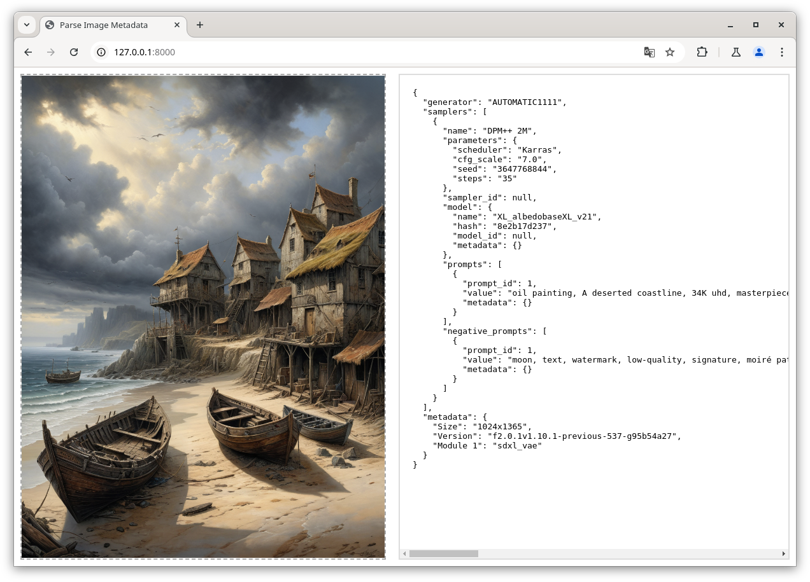

# SD Image Parsing Service

This is a simple mockup of an image parsing webservice. Feel free to use it as you see fit. Please note that this project is provided as-is, and will probably not be actively maintained or updated in the future.



## Installation

To set up the project, follow these steps:

1. Clone the repository and navigate into the directory:
    ```sh
    git clone https://github.com/d3x-at/sd-parsers-web
    cd sd-parsers-web
    ```

2. Create and activate a virtual environment:
    ```sh
    python3 -m venv .venv
    source .venv/bin/activate
    ```

3. Install the necessary dependencies:
    ```sh
    pip3 install -r requirements.txt
    ```

4. Run the service:
    ```sh
    python3 parser.py
    ```

## Powered by:
* [FastAPI](https://github.com/fastapi/fastapi)
* [Uvicorn](https://github.com/encode/uvicorn)
* [sd-parsers](https://github.com/d3x-at/sd-parsers)

Example image created by [HHGomez](https://civitai.com/user/HHGomez) on [CivitAI](https://civitai.com/images/31593924).